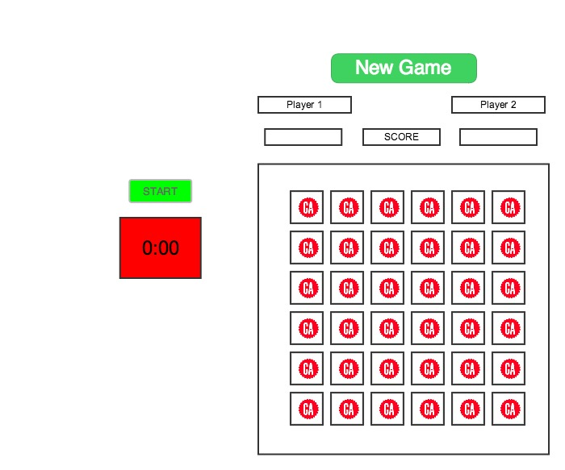

# Project #1 - Jeff Lipp

## GA Matching

This online game will be a version of well-known Concentration Game, customized with GA-based pictures.  This game will test players ability to uncover the matching set of pictures most efficiently.

This is a two-player game that requires concentration, focus, and performance under a highly stressful situation.  This game is **not** a game for the timid.

### Objective of the game

A player must complete the entire board by finding and exposing all of the pairs of matching pictures more efficiently than her competition.  The pairs will be found by clicking on the two  matching, hidden pictures sequentially.

#### Scoring

Each player starts with a score or 1,000.

Final scoring takes into account two factors:

1. Time elapsed to finish the board  
2. Number of total attempts required to complete the board

Scoring algorithm:  

1000 - (seconds to complete round - (# of attempts * 5))

#### Game Board Layout

The playing grid is a 6 x 6 grid with a total of 36 playing sqaures, holding 18 pairs of pictures.  

(The first day of WDI-18 conveniently offered up 18 individuals in the naming circle exercise). 

### Player Game Flow
 
* Player 1 will click 'New Game' in order to 'shuffle the deck,' click on 'Start Clock' and play the round by clicking on the available, hidden squares in order to reveal the photographs to find matches. 
* Once the baord is complete, a score will be generated. alerted and placed on the scorebaord.  
* Player 2 will now proceed with the same steps starting with the 'Start Clock' step.  

#### Winner Declaration

The game will compare the respective scores of the two Players and declare a winner.

###Preliminary Wireframe (6 x 6 is only option)  

#### Features/upgrades for future versions of the game

* Create a High Scores or Top 10 Scores list section that stores scores collected from all games played
* Add speed round elements and scoring
* Flip a virtual coin to determine who goes first
* Animation on a win - maybe video of an awkward celebration dance

